  

  

<h1 align="center">✈️ Agentic AI Travel Planner</h1>

  <strong>A multi-agent, tool-augmented AI travel concierge powered by LangGraph, Groq, and real-time APIs.</strong>

  
  
  
  

  <em>"Veriden Değere, Algoritmadan Anlama"</em>

---

  

## 🚀 Program Özellikleri

<table align="center">
  <tr>
    <td align="center"><b>14 Hafta</b> Kapsamlı Müfredat</td>
    <td align="center"><b>50+ Kavram</b> Derinlemesine İçerik</td>
    <td align="center"><b>2 Proje Sunumu</b> Ara & Final Projeleri</td>
    <td align="center"><b>∠Potansiyel</b> Sınırsız Öğrenme</td>
  </tr>
</table>

---

## 🏗️ System Architecture

```mermaid
graph TB
    subgraph "🖥️ Frontend — Flask :5000"
        A[🌐 Landing Page<br>GSAP + Tailwind + Glassmorphism] --> B[💬 Chat Interface<br>Markdown + Typing Indicator]
        B --> C[🗺️ Leaflet.js Map<br>Auto Marker Plotting]
        B --> D[📄 PDF Export<br>xhtml2pdf Branded Docs]
        A --> E[⚙️ Preferences Modal<br>SQLite Persistence]
    end

    subgraph "⚡ Backend — FastAPI :8000"
        F[🔀 API Router] --> G[🧠 LangGraph Agent<br>ReAct Loop]
        F --> H[📦 Preference CRUD<br>SQLAlchemy ORM]
        G --> I[🛠️ Tool Orchestrator]
    end

    subgraph "🛠️ Agent Tools"
        I --> J[🌤️ OpenWeatherMap<br>Current + 5-Day Forecast]
        I --> K[📍 Google Places<br>Search + Reviews + Coords]
        I --> L[💱 Frankfurter API<br>Real-Time Exchange Rates]
        I --> M[🧮 Calculator<br>Budget + Tax + Tips]
    end

    subgraph "💾 Persistence Layer"
        N[(🗄️ SQLite Database)]
        H --> N
        G -->|Inject Preferences| N
    end

    subgraph "🤖 LLM Provider"
        O[⚡ Groq Cloud<br>Llama 3.3-70B Versatile]
    end

    B -->|POST /query| F
    E -->|POST /preferences| F
    D -->|POST /export_pdf| F
    G --> O
    O --> G

    style A fill:#001F3F,stroke:#FFD700,color:#FFD700
    style B fill:#001F3F,stroke:#FFD700,color:#FFD700
    style G fill:#1a1a2e,stroke:#e94560,color:#FFD700
    style O fill:#0d0d0d,stroke:#e94560,color:#e94560
```

---

## 🎯 The Core Philosophy: "Problem Çözme Sanatı"

Travel planning is a complex optimization problem. Our agent doesn't just "talk"; it **analyzes** and **executes**.

1.  **Reasoning:** The agent breaks down your request into logical sub-tasks.
2.  **Action:** It triggers real-time data fetching (Weather, Places, Currency).
3.  **Synthesis:** It compiles a data-driven, personalized itinerary.

---

## ✨ Key Technical Pillars

  
  
  
  

### 🧠 Long-Term Memory
Persistent user profiling powered by **SQLite**. Your preferences (budget, dietary, pace) are dynamically injected into every plan.

### 🗺️ Interactive Mapping
**Leaflet.js** integration with gold-themed markers. Pins are automatically dropped on the map as the agent plans your route.

### 📄 PDF Engine
Branded, print-ready PDF exports using `xhtml2pdf`. One-click professional travel docs.

---

## 🔧 Tech Stack

  
  
  
  
  
  

---

## 🛠️ Installation & Setup

1.  **Clone:** `git clone https://github.com/MustafaKocamann/AI-Based-Trip-Planner.git`
2.  **Env:** `cp .env.example .env` (Add your Groq & OpenWeather keys)
3.  **Setup:** `pip install -r requirements.txt`
4.  **Backend:** `uvicorn main:app --port 8000`
5.  **Frontend:** `python flask_app/app.py`
6.  **Explore:** `http://localhost:5000`

---

  

<h3 align="center">💛 Lead Developer: <a href="https://github.com/MustafaKocamann">Mustafa Kocaman</a></h3>

  
  

