```mermaid
graph TB
    subgraph "🖥️ Frontend — Flask :5000"
        A[🌐 Landing Page<br>GSAP + Tailwind + Glassmorphism] --> B[💬 Chat Interface<br>Markdown + Typing Indicator]
        B --> C[🗺️ Leaflet.js Map<br>Auto Marker Plotting]
        B --> D[📄 PDF Export<br>xhtml2pdf Branded Docs]
        A --> E[⚙️ Preferences Modal<br>SQLite Persistence]
    end

    subgraph "⚡ Backend — FastAPI :8000"
        F[🔀 API Router] --> G[🧠 LangGraph Agent<br>ReAct Loop]
        F --> H[📦 Preference CRUD<br>SQLAlchemy ORM]
        G --> I[🛠️ Tool Orchestrator]
    end

    subgraph "🛠️ Agent Tools"
        I --> J[🌤️ OpenWeatherMap<br>Current + 5-Day Forecast]
        I --> K[📍 Google Places<br>Search + Reviews + Coords]
        I --> L[💱 Frankfurter API<br>Real-Time Exchange Rates]
        I --> M[🧮 Calculator<br>Budget + Tax + Tips]
    end

    subgraph "💾 Persistence Layer"
        N[(🗄️ SQLite Database)]
        H --> N
        G -->|Inject Preferences| N
    end

    subgraph "🤖 LLM Provider"
        O[⚡ Groq Cloud<br>Llama 3.3-70B Versatile]
    end

    B -->|POST /query| F
    E -->|POST /preferences| F
    D -->|POST /export_pdf| F
    G --> O
    O --> G

    style A fill:#001F3F,stroke:#FFD700,color:#FFD700
    style B fill:#001F3F,stroke:#FFD700,color:#FFD700
    style G fill:#1a1a2e,stroke:#e94560,color:#FFD700
    style O fill:#0d0d0d,stroke:#e94560,color:#e94560
```

<p align="center">
  
</p>

<p align="center">
  
</p>

<h1 align="center">✈️ Agentic AI Travel Planner</h1>

<p align="center">
  <strong>A Multi-Agent, Tool-Augmented AI Travel Concierge — powered by LangGraph, Groq, and Real-Time APIs.</strong>
</p>

<p align="center">
  <a href="https://github.com/MustafaKocamann/AI-Based-Trip-Planner"></a>
  <a href="https://github.com/MustafaKocamann/AI-Based-Trip-Planner"></a>
  <a href="#"></a>
  <a href="#"></a>
  <a href="#"></a>
</p>

<p align="center">
  
</p>

---

## 📸 Visual Hook & System Architecture

<p align="center">
  
  <br/>
  <em>🎬 **Main Dashboard Preview:** AI-driven itinerary generation, interactive mapping, and PDF export in action.</em>
</p>

### 🏗️ Agentic Workflow (LangGraph)



---

## 🎯 The 'Why' - Solving the Paradox of Choice

Travel planning is broken. Travelers today navigate a "choice paradox," bouncing between 10+ tabs: hotel aggregators, weather sites, currency converters, Map tools, and review platforms. By the time they have gathered enough data, decision fatigue sets in.

**Agentic AI Travel Planner** solves this by providing a single conversional interface where **Multi-Agent AI** does the heavy lifting. It doesn't just "chat"—it researches, calculates, validates, and plan. It's not a hallucination engine; it's an execution engine.

---

## ✨ Key Features

<p align="center">
  
  
  
</p>

### 🧠 Long-Term Memory
Persistent user profiling powered by **SQLite + SQLAlchemy**. Your historical preferences (dietary, pace, budget) are stored and dynamically injected into the AI's system prompt for a truly personalized experience.

### 🗺️ Interactive Mapping
Seamless **Leaflet.js** integration. The AI doesn't just suggest places; it drops gold-themed markers on a dark-themed interactive map in real-time.

### ⚡ Lightning Fast Inference
Leveraging **Groq Cloud** with **Meta’s Llama-3.3-70B**. Sub-second token generation provides a near-instant "Senior AI" consultation feel.

### 📊 Financial Dashboard
Precise budgeting with **real-time exchange rates** (Frankfurter API) and a precision calculator. No more manual math on currency spreads.

---

## 🔧 Tech Stack

| Category | tools |
| :--- | :--- |
| **🤖 LLM** | Groq (Llama 3.3-70B), LangChain |
| **🧩 Framework** | FastAPI, Flask, LangGraph |
| **🔍 Search** | Tavily, Google Places API |
| **🌐 API** | OpenWeatherMap, Frankfurter |
| **🎨 Frontend** | Tailwind CSS, GSAP, Leaflet.js |

---

## ⚙️ Installation & Setup

### Step 1: Clone the Repository
```bash
git clone https://github.com/MustafaKocamann/AI-Based-Trip-Planner.git
cd AI-Based-Trip-Planner
```

### Step 2: Environment Configuration
```bash
cp .env.example .env
# Fill in your GROQ_API_KEY and OPENWEATHERMAP_API_KEY
```

### Step 3: Deployment
```bash
pip install -r requirements.txt

# Terminal 1: Launch Backend
uvicorn main:app --reload --port 8000

# Terminal 2: Launch Frontend
python flask_app/app.py
```

### Step 4: Launch
```
🌐 Visit http://localhost:5000
```

---

## 🧬 Engineering Highlight: The Agentic Workflow

This project utilizes a **ReAct (Reasoning + Acting)** pattern implemented via **LangGraph**. Unlike standard linear LLM chains, our agent:

1.  **Observes** the user request and user preferences from SQLite.
2.  **Reasons** about which tool is required (e.g., "I need weather data before I suggest outdoor activities").
3.  **Acts** by triggering the ToolNode to call external APIs.
4.  **Refines** the plan based on tool results, repeating the loop until a multi-day itinerary is fully validated.

---

## 🗺️ Future Roadmap (Growth Hacker's Vision)

- [ ] **Mobile App Integration:** Swift/Kotlin wrappers for planning on-the-go.
- [ ] **Voice AI Assistant:** Whisper + Piper integration for hands-free concierge service.
- [ ] **Global Scaling:** Multi-language support and direct booking integration (Amadeus/Skyscanner).

---

## 📄 License & Credits

Lead Developer: **Mustafa Kocaman**  
License: **MIT**

<p align="center">
  
</p>

<h3 align="center">💛 Built for the Future of AI Travel</h3>

<p align="center">
  <a href="https://github.com/MustafaKocamann">
    
  </a>
  <a href="https://linkedin.com/in/mustafakocaman">
    
  </a>
</p>
