<p align="center">
  
</p>

<h1 align="center">✈️ Agentic AI Travel Planner</h1>

<p align="center">
  <strong>A Multi-Agent, Tool-Augmented AI Travel Concierge — powered by LangGraph, Groq, and Real-Time APIs.</strong>
</p>

<p align="center">
  <em>Solving the paradox of choice in travel planning with autonomous AI agents that research, calculate, and plan — so you don't have to.</em>
</p>

<p align="center">
  <a href="#"></a>
  <a href="#"></a>
  <a href="#"></a>
  <a href="#"></a>
  <a href="#"></a>
  <a href="#"></a>
</p>


---

<p align="center">
  
</p>

## 📸 Visual Preview

<p align="center">
  
  <br/>
  <em>🎬 The AI Concierge generating a 5-day Paris itinerary with live weather, map pins, and PDF export.</em>
</p>

---

## 🏗️ System Architecture

```mermaid
graph TB
    subgraph "🖥️ Frontend — Flask :5000"
        A[🌐 Landing Page<br>GSAP + Tailwind + Glassmorphism] --> B[💬 Chat Interface<br>Markdown + Typing Indicator]
        B --> C[🗺️ Leaflet.js Map<br>Auto Marker Plotting]
        B --> D[📄 PDF Export<br>xhtml2pdf Branded Docs]
        A --> E[⚙️ Preferences Modal<br>SQLite Persistence]
    end

    subgraph "⚡ Backend — FastAPI :8000"
        F[🔀 API Router] --> G[🧠 LangGraph Agent<br>ReAct Loop]
        F --> H[📦 Preference CRUD<br>SQLAlchemy ORM]
        G --> I[🛠️ Tool Orchestrator]
    end

    subgraph "🛠️ Agent Tools"
        I --> J[🌤️ OpenWeatherMap<br>Current + 5-Day Forecast]
        I --> K[📍 Google Places<br>Search + Reviews + Coords]
        I --> L[💱 Frankfurter API<br>Real-Time Exchange Rates]
        I --> M[🧮 Calculator<br>Budget + Tax + Tips]
    end

    subgraph "💾 Persistence Layer"
        N[(🗄️ SQLite Database)]
        H --> N
        G -->|Inject Preferences| N
    end

    subgraph "🤖 LLM Provider"
        O[⚡ Groq Cloud<br>Llama 3.3-70B Versatile]
    end

    B -->|POST /query| F
    E -->|POST /preferences| F
    D -->|POST /export_pdf| F
    G --> O
    O --> G

    style A fill:#001F3F,stroke:#FFD700,color:#FFD700
    style B fill:#001F3F,stroke:#FFD700,color:#FFD700
    style G fill:#1a1a2e,stroke:#e94560,color:#FFD700
    style O fill:#0d0d0d,stroke:#e94560,color:#e94560
```



---

## 🎯 The Problem We Solve

> **The Paradox of Choice in Travel Planning.**
>
> Travelers today face 10+ tabs open simultaneously — hotel aggregators, weather sites, currency converters, review platforms, map tools. By the time they've gathered the data, decision fatigue has set in.

**Our solution:** A single conversational interface backed by **autonomous AI agents** that orchestrate real-time tool calls, synthesize data from multiple APIs, and deliver complete, data-driven travel plans — including weather forecasts, budgets in your currency, restaurant recommendations with ratings, and an interactive map with every location pinned.

This isn't a chatbot wrapper. It's a **multi-tool agentic workflow** built on **LangGraph's ReAct pattern** — where the AI decides which tools to call, in what order, and how to combine their outputs into a coherent plan.

---

## ✨ Key Features

<table>
<tr>
<td width="50%">

### 🧠 Long-Term Memory
Persistent user profiling powered by **SQLite + SQLAlchemy**. Your preferences (budget style, dietary needs, travel pace) are stored and **dynamically injected** into the LLM's system prompt — every plan is personalised.

</td>
<td width="50%">

### 🗺️ Interactive Mapping
**Leaflet.js** with dark CARTO tiles and gold-themed markers. The AI response is parsed for coordinates in real-time, and pins are **automatically dropped** on the map. Navy-themed popups match the brand.

</td>
</tr>
<tr>
<td width="50%">

### ⚡ Lightning-Fast Inference
Powered by **Groq Cloud** running **Meta's Llama 3.3-70B Versatile**. Sub-second token generation with the quality of a 70B parameter model. No GPU required on your end.

</td>
<td width="50%">

### 📊 Financial Dashboard
Real-time currency conversion via the **Frankfurter API** + a precision calculator with tax, tip, and percentage tools. Complete cost breakdowns in your preferred currency.

</td>
</tr>
<tr>
<td width="50%">

### 🌤️ Live Weather Intelligence
**OpenWeatherMap** integration for current conditions and 5-day forecasts. The agent automatically calls weather tools and factors conditions into itinerary recommendations.

</td>
<td width="50%">

### 📄 PDF Export
One-click export of any AI-generated plan to a **branded, print-ready PDF** with Navy + Gold styling, structured tables, and a professional header/footer. Powered by `xhtml2pdf`.

</td>
</tr>
<tr>
<td width="50%">

### 📍 Smart Place Discovery
**Google Places API** integration returning rich data: ratings, review counts, coordinates, types, and top review snippets. The agent uses both text search and detail endpoints.

</td>
<td width="50%">

### 🎨 Premium UI/UX
**Glassmorphism** design with GSAP animations, particle canvas background, Tailwind CSS, responsive layout, and a floating CTA. Designed to feel like a luxury concierge service.

</td>
</tr>
</table>

---

## 🔧 Tech Stack

<table align="center">
<tr>
<th>Category</th>
<th>Technology</th>
</tr>
<tr>
<td><strong>🤖 LLM</strong></td>
<td> </td>
</tr>
<tr>
<td><strong>🧩 Agent Framework</strong></td>
<td> </td>
</tr>
<tr>
<td><strong>⚡ Backend</strong></td>
<td> </td>
</tr>
<tr>
<td><strong>🌐 Frontend</strong></td>
<td>  </td>
</tr>
<tr>
<td><strong>🗺️ Maps</strong></td>
<td></td>
</tr>
<tr>
<td><strong>📡 APIs</strong></td>
<td>  </td>
</tr>
<tr>
<td><strong>💾 Database</strong></td>
<td></td>
</tr>
<tr>
<td><strong>📄 PDF</strong></td>
<td></td>
</tr>
</table>

---

## 🧬 Agentic Workflow — How It Works

This project uses **LangGraph's ReAct (Reasoning + Acting) pattern** to create a truly autonomous agent. Unlike simple prompt-chain applications, the agent:

1. **Reasons** about the user's request and decides which tools to call
2. **Acts** by executing tool calls (weather, places, currency, calculator)
3. **Observes** the results and decides whether to call more tools or respond
4. **Iterates** until it has gathered enough data for a comprehensive plan

```
User: "Plan 5 days in Paris for $2000"
  │
  ▼
┌──────────────────────────────────────────────────┐
│  🧠 LangGraph ReAct Agent (Llama 3.3-70B)       │
│                                                    │
│  Step 1: "I need weather for Paris"                │
│  → calls get_current_weather("Paris")              │
│  → calls get_weather_forecast("Paris", 5)          │
│                                                    │
│  Step 2: "I need hotels and restaurants"            │
│  → calls search_places("hotels", "Paris")          │
│  → calls search_places("restaurants", "Paris")     │
│                                                    │
│  Step 3: "I need to convert $2000 to EUR"           │
│  → calls convert_currency(2000, "USD", "EUR")      │
│                                                    │
│  Step 4: "Let me calculate per-day budget"          │
│  → calls calculate("divide", 1850, 5)              │
│                                                    │
│  Step 5: Synthesise all data into a plan            │
│  → Returns complete Markdown itinerary             │
└──────────────────────────────────────────────────┘
  │
  ▼
📋 Day-by-day itinerary with weather, budgets, map pins, & PDF export
```

### Guard Rails & Error Resilience

- **System Prompt Guard:** The system prompt is always injected as the first message, regardless of state history
- **Tool Failure Guard:** Empty or `None` tool responses are replaced with descriptive error strings
- **Preference Injection:** User preferences from SQLite are dynamically appended to the system prompt per session
- **Graceful Degradation:** If a tool fails (API down, timeout), the agent acknowledges it and proceeds with available data

---

## 📁 Project Structure

```
📦 ai-travel-planner/
├── 🤖 agents/
│   └── agentic_workflow.py     # LangGraph ReAct agent (GraphBuilder)
├── 🛠️ tools/
│   ├── calculator_tool.py      # Budget arithmetic tools
│   ├── currency_conversion.py  # Currency exchange tool
│   ├── place_search.py         # Google Places search + details
│   └── weather_information.py  # Weather current + forecast tools
├── ⚙️ utils/
│   ├── calculator.py           # Calculator with float-safe arithmetic
│   ├── currency_converter.py   # Frankfurter API wrapper
│   ├── place_info.py           # Google Places API (enriched)
│   ├── weather_info.py         # OpenWeatherMap API wrapper
│   ├── pdf_generator.py        # Markdown → Branded PDF
│   ├── model_loader.py         # LLM provider factory
│   ├── config_loader.py        # YAML config reader
│   └── save_document.py        # Document I/O utilities
├── 🌐 flask_app/
│   ├── app.py                  # Flask routes (query, prefs, PDF export)
│   ├── templates/
│   │   └── index.html          # Glassmorphism UI + Leaflet map
│   └── static/
│       ├── css/style.css       # Navy + Gold design system
│       └── js/main.js          # GSAP animations + Leaflet + Chat
├── 📝 prompt_library/
│   └── prompt.py               # SYSTEM_PROMPT for the AI agent
├── ⚙️ config/
│   └── config.yaml             # LLM model configuration
├── 📊 models.py                # SQLAlchemy ORM + PreferenceManager
├── 🚀 main.py                  # FastAPI application (API server)
├── 🖥️ app.py                   # Streamlit interface (alternative)
├── 📋 requirements.txt
├── 🔒 .env.example
└── 📖 README.md
```

---

## 🚀 Installation & Setup

### Prerequisites

- Python 3.11+
- A [Groq API Key](https://console.groq.com/) (free tier available)
- An [OpenWeatherMap API Key](https://openweathermap.org/api) (free tier)
- A [Google Places API Key](https://developers.google.com/maps/documentation/places/web-service) (optional)

### Step 1: Clone the Repository

```bash
git clone https://github.com/MustafaKocamann/ai-travel-planner.git
cd ai-travel-planner
```

### Step 2: Create & Activate Virtual Environment

```bash
python -m venv venv

# Windows
venv\Scripts\activate

# macOS / Linux
source venv/bin/activate
```

### Step 3: Install Dependencies

```bash
pip install -r requirements.txt
```

### Step 4: Configure Environment Variables

```bash
cp .env.example .env
```

Edit `.env` with your API keys:

```env
GROQ_API_KEY=gsk_your_groq_api_key_here
OPENWEATHERMAP_API_KEY=your_openweathermap_key_here
GOOGLE_PLACES_API_KEY=your_google_places_key_here  # optional
```

### Step 5: Launch the Application

Open **two terminals** and run:

```bash
# Terminal 1 — FastAPI Backend (port 8000)
uvicorn main:app --reload --port 8000
```

```bash
# Terminal 2 — Flask Frontend (port 5000)
python flask_app/app.py
```

### Step 6: Open in Browser

```
🌐 http://localhost:5000
```

> 💡 **Tip:** Complex trip plans (multi-day, multi-city) may take 1–3 minutes as the agent calls multiple tools sequentially.

---

## 💬 Usage Examples

| Query | What the Agent Does |
|-------|-------------------|
| `"Plan 5 days in Paris for $2000"` | Weather + Hotels + Restaurants + Currency conversion + Budget breakdown |
| `"What's the weather in Tokyo?"` | Calls OpenWeatherMap API for current conditions |
| `"Best restaurants in Rome"` | Calls Google Places API with ratings and coordinates |
| `"Convert 500 USD to EUR"` | Calls Frankfurter API for live exchange rates |

---

## 🗺️ Future Roadmap

<table>
<tr>
<td>🔜 <strong>v2.1</strong></td>
<td>Voice AI integration — plan trips via voice commands using Whisper</td>
</tr>
<tr>
<td>📱 <strong>v3.0</strong></td>
<td>Mobile-first PWA with offline support and push notifications</td>
</tr>
<tr>
<td>🌍 <strong>v4.0</strong></td>
<td>Multi-language support (TR, DE, FR, ES, JA) with auto-detection</td>
</tr>
<tr>
<td>🏨 <strong>v5.0</strong></td>
<td>Direct booking integration — hotels, flights, and activities</td>
</tr>
<tr>
<td>👥 <strong>v6.0</strong></td>
<td>Collaborative trip planning — share and co-edit plans in real-time</td>
</tr>
<tr>
<td>📈 <strong>v7.0</strong></td>
<td>Price prediction engine — ML-powered fare & hotel cost forecasting</td>
</tr>
</table>

---

## 🤝 Contributing

Contributions are welcome! Please feel free to submit a Pull Request.

1. Fork the repository
2. Create your feature branch (`git checkout -b feature/amazing-feature`)
3. Commit your changes (`git commit -m 'Add amazing feature'`)
4. Push to the branch (`git push origin feature/amazing-feature`)
5. Open a Pull Request

---

## 📄 License

This project is licensed under the **MIT License** — see the [LICENSE](LICENSE) file for details.

---

<p align="center">
  
</p>

<h3 align="center">💛 Built with passion by <a href="https://github.com/MustafaKocamann">Mustafa Kocaman</a></h3>

<p align="center">
  <em>If this project helped you, consider giving it a ⭐ — it means the world!</em>
</p>

<p align="center">
  <a href="https://github.com/MustafaKocamann">
    
  </a>
  <a href="https://linkedin.com/in/mustafakocaman">
    
  </a>
</p>
