  

  

<h1 align="center">✈️ Agentic AI Travel Planner</h1>

  <strong>A Multi-Agent, Tool-Augmented AI Travel Concierge — powered by LangGraph, Groq, and Real-Time APIs.</strong>

  <em>Solving the paradox of choice in travel planning using autonomous AI agents that research, calculate, and plan.</em>

  
  
  
  

---

  

## 📸 Visual Preview

  
   
  <em>🎬 The AI Concierge generating a 5-day Paris itinerary with live weather, map pins, and PDF export.</em>

---

## 🏗️ System Architecture

```mermaid
graph TB
    subgraph "🖥️ Frontend — Flask :5000"
        A[🌐 Landing Page<br>GSAP + Tailwind + Glassmorphism] --> B[💬 Chat Interface<br>Markdown + Typing Indicator]
        B --> C[🗺️ Leaflet.js Map<br>Auto Marker Plotting]
        B --> D[📄 PDF Export<br>xhtml2pdf Branded Docs]
        A --> E[⚙️ Preferences Modal<br>SQLite Persistence]
    end

    subgraph "⚡ Backend — FastAPI :8000"
        F[🔀 API Router] --> G[🧠 LangGraph Agent<br>ReAct Loop]
        F --> H[📦 Preference CRUD<br>SQLAlchemy ORM]
        G --> I[🛠️ Tool Orchestrator]
    end

    subgraph "🛠️ Agent Tools"
        I --> J[🌤️ OpenWeatherMap<br>Current + 5-Day Forecast]
        I --> K[📍 Google Places<br>Search + Reviews + Coords]
        I --> L[💱 Frankfurter API<br>Real-Time Exchange Rates]
        I --> M[🧮 Calculator<br>Budget + Tax + Tips]
    end

    subgraph "💾 Persistence Layer"
        N[(🗄️ SQLite Database)]
        H --> N
        G -->|Inject Preferences| N
    end

    subgraph "🤖 LLM Provider"
        O[⚡ Groq Cloud<br>Llama 3.3-70B Versatile]
    end

    B -->|POST /query| F
    E -->|POST /preferences| F
    D -->|POST /export_pdf| F
    G --> O
    O --> G

    style A fill:#001F3F,stroke:#FFD700,color:#FFD700
    style B fill:#001F3F,stroke:#FFD700,color:#FFD700
    style G fill:#1a1a2e,stroke:#e94560,color:#FFD700
    style O fill:#0d0d0d,stroke:#e94560,color:#e94560
```

---

## 🎯 The Problem We Solve

> **The Paradox of Choice in Travel Planning.**
>
> Travelers today face 10+ tabs open simultaneously — hotel aggregators, weather sites, currency converters, review platforms, map tools. By the time they've gathered the data, decision fatigue has set in.

**Our solution:** A single conversational interface backed by **autonomous AI agents** that orchestrate real-time tool calls, synthesize data from multiple APIs, and deliver complete, data-driven travel plans.

---

## ✨ Key Features

<table>
<tr>
<td width="50%">

### 🧠 Long-Term Memory
Persistent user profiling powered by **SQLite**. Your preferences are dynamically injected into every plan.

</td>
<td width="50%">

### 🗺️ Interactive Mapping
**Leaflet.js** integration with gold-themed markers. Pins are automatically dropped as the agent plans your route.

</td>
</tr>
<tr>
<td width="50%">

### ⚡ Lightning-Fast Inference
Powered by **Groq Cloud** running **Llama 3.3-70B**. Sub-second token generation for smooth experience.

</td>
<td width="50%">

### 📊 Financial Dashboard
Real-time currency conversion via the **Frankfurter API** + a precision budget calculator.

</td>
</tr>
<tr>
<td width="50%">

### 🌤️ Live Weather Intelligence
**OpenWeatherMap** integration for current conditions and 5-day forecasts factored into itineraries.

</td>
<td width="50%">

### 📄 PDF Export
One-click export of any AI-generated plan to a **branded, print-ready PDF** using `xhtml2pdf`.

</td>
</tr>
</table>

---

## 🔧 Tech Stack

  
  
  
  
  
  

---

## 🧬 Agentic Workflow — How It Works

This project uses **LangGraph's ReAct (Reasoning + Acting) pattern** to create a truly autonomous agent. The agent:
1. **Reasons** about the request and decides which tools to call.
2. **Acts** by executing tool calls (Weather, Places, Currency, Calculator).
3. **Observes** the results and refines the plan.
4. **Responds** with a comprehensive, data-backed Markdown itinerary.

---

## 🚀 Installation & Setup

1.  **Clone:** `git clone https://github.com/MustafaKocamann/AI-Based-Trip-Planner.git`
2.  **Environment:** `cp .env.example .env` (Add your API keys)
3.  **Install:** `pip install -r requirements.txt`
4.  **Backend:** `uvicorn main:app --port 8000`
5.  **Frontend:** `python flask_app/app.py`
6.  **Run:** Open `http://localhost:5000`

---

  

<h3 align="center">💛 Built with passion by <a href="https://github.com/MustafaKocamann">Mustafa Kocaman</a></h3>

  
  

